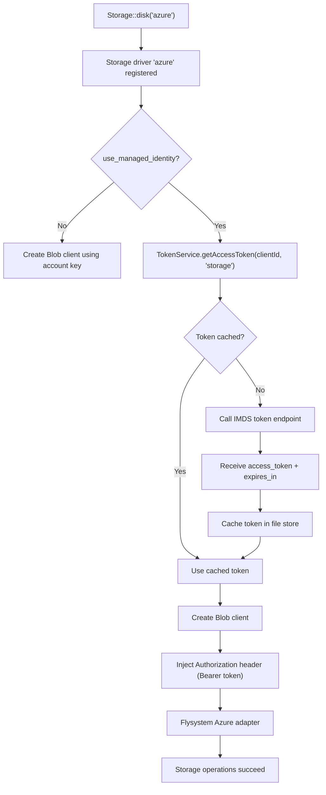
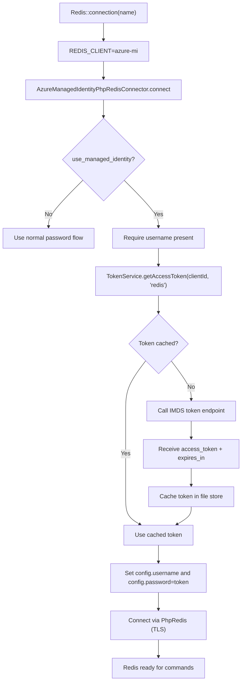
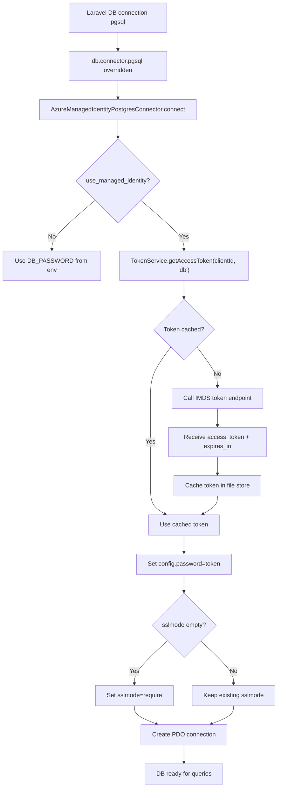

# CleverSo Azure Managed Identity for Laravel

This package enables **Azure Managed Identity (MI)** authentication for:

1) **Azure Blob Storage** (Laravel `Storage` disk: `azure`)
2) **Azure Cache for Redis** (Laravel Redis client: `azure-mi`)
3) **Azure Database for PostgreSQL** (Laravel DB connector: `pgsql`)

It fetches **short-lived access tokens** from the Azure Instance Metadata Service (IMDS), caches them (recommended: `file` cache), then injects them into each client connection so the application can authenticate **without long-lived secrets**.

---

## Table of Contents

- [High-Level Overview](#high-level-overview)
- [Token Service](#token-service)
- [Configuration](#configuration)
    - [Config File](#config-file)
    - [.env Variables](#env-variables)
- [Azure Blob Storage](#azure-blob-storage)
    - [How It Works](#how-blob-works)
    - [Mermaid Flow Chart](#blob-mermaid-flow-chart)
    - [Test Command](#blob-test-command)
- [Azure Redis](#azure-redis)
    - [How It Works](#how-redis-works)
    - [Mermaid Flow Chart](#redis-mermaid-flow-chart)
    - [Test Command](#redis-test-command)
- [Azure PostgreSQL (pgsql)](#azure-postgresql-pgsql)
    - [How It Works](#how-db-works)
    - [Mermaid Flow Chart](#db-mermaid-flow-chart)
    - [Notes About Read/Write Hosts](#notes-about-readwrite-hosts)
- [Logging](#logging)
- [Security Notes](#security-notes)
- [Troubleshooting](#troubleshooting)

---

## High-Level Overview

All services follow the same MI pattern:

1) **Determine** if MI is enabled for that service/connection.
2) **Fetch** a token from IMDS:
    - Endpoint: `http://169.254.169.254/metadata/identity/oauth2/token`
    - Header: `Metadata: true`
    - Params:
        - `api-version=...`
        - `resource=...`
        - optional `client_id=...` (User Assigned Managed Identity)
3) **Cache** the token in Laravel cache (recommended: `file`).
4) **Inject** the token into the relevant client:
    - Storage: `Authorization: Bearer <token>`
    - Redis: `password=<token>` (and `username=<aad-user>`)
    - PostgreSQL: `password=<token>`
5) **Connect** normally through Laravel APIs.

---

## Token Service

### Class
`CleverSo\AzureManagedIdentity\Services\AzureManagedIdentityTokenService`

### Responsibilities
- Read resource configuration from: `config('azure-managed-identity.resources.<key>')`
- Fetch token from IMDS with the correct:
    - `resource`
    - `api-version`
    - optional `client_id`
- Cache tokens by:
    - resource key (e.g. `storage`, `redis`, `db`)
    - client id (or `system`)
- Apply a buffer before expiry to reduce refresh failures.

### Token caching key pattern
```
azure_managed_identity_token:<resource_key>:<client_id|system>
```

### Why file cache is recommended
- Avoids any circular dependency (for example: if Redis needs MI, you must not depend on Redis to cache the MI token).
- Keeps startup reliable.
- Works well in containers as long as the filesystem is writable.

---

## Configuration

### Config File

`config/azure-managed-identity.php`

```php
return [
    'cache_store' => env('AZURE_MI_CACHE_STORE', 'file'),
    'cache_buffer' => env('AZURE_MI_CACHE_BUFFER', 300),
    'timeout' => env('AZURE_MI_TIMEOUT', 10),

    'resources' => [
        'storage' => [
            'resource' => env('AZURE_MI_STORAGE_RESOURCE', 'https://storage.azure.com/'),
            'api_version' => env('AZURE_MI_STORAGE_API_VERSION', '2018-02-01'),
            'cache_store' => env('AZURE_MI_STORAGE_CACHE_STORE', null),
        ],
        'redis' => [
            'resource' => env('AZURE_MI_REDIS_RESOURCE', 'https://redis.azure.com'),
            'api_version' => env('AZURE_MI_REDIS_API_VERSION', '2019-08-01'),
            'cache_store' => env('AZURE_MI_REDIS_CACHE_STORE', null),
        ],
        'db' => [
            'resource' => env('AZURE_MI_DB_RESOURCE', 'https://ossrdbms-aad.database.windows.net'),
            'api_version' => env('AZURE_MI_DB_API_VERSION', '2019-08-01'),
            'cache_store' => env('AZURE_MI_DB_CACHE_STORE', null),
        ],
    ],
];
```

### .env Variables

Minimum recommended variables (based on the provided classes):

```env
# Common
AZURE_USE_MANAGED_IDENTITY=true
AZURE_CLIENT_ID=xxxxxxxx-xxxx-xxxx-xxxx-xxxxxxxxxxxx

# Token caching (recommended)
AZURE_MI_CACHE_STORE=file
AZURE_MI_CACHE_BUFFER=300
AZURE_MI_TIMEOUT=10

# Storage (Blob)
AZURE_MI_STORAGE_RESOURCE=https://storage.azure.com/
AZURE_MI_STORAGE_API_VERSION=2018-02-01

# Redis
AZURE_MI_REDIS_RESOURCE=https://redis.azure.com
AZURE_MI_REDIS_API_VERSION=2019-08-01

# PostgreSQL
AZURE_MI_DB_RESOURCE=https://ossrdbms-aad.database.windows.net
AZURE_MI_DB_API_VERSION=2019-08-01
DB_USE_MANAGED_IDENTITY=true
DB_SSLMODE=require
```

---

# Azure Blob Storage

## How Blob Works

### Classes involved
- Service Provider:
    - `CleverSo\AzureManagedIdentity\Providers\AzureServiceProvider`
- Disk adapter:
    - `CleverSo\AzureManagedIdentity\Filesystem\AzureAdapter`
- Blob client wrapper:
    - `CleverSo\AzureManagedIdentity\Services\ManagedIdentityBlobRestProxy`
- Token fetcher:
    - `CleverSo\AzureManagedIdentity\Services\AzureManagedIdentityTokenService`

### What happens when you call `Storage::disk('azure')`?

1) `AzureServiceProvider::boot()` registers a custom driver:
    - `Storage::extend('azure', ...)`
2) When the disk is used:
    - If `use_managed_identity=true` in the disk config:
        - Fetch token using `TokenService->getAccessToken($clientId, 'storage')`
3) The blob client is created:
    - `ManagedIdentityBlobRestProxy::createWithManagedIdentity(...)`
4) A custom Guzzle middleware injects:
    - `Authorization: Bearer <token>`
    - `x-ms-version: 2021-08-06`
5) Flysystem adapter is created and returned as a Laravel disk.
6) Your app uses it like normal:
    - list files
    - put files
    - get files
    - delete files
    - etc.

### Why a custom HTTP client is injected
The `microsoft/azure-storage-blob` SDK is primarily designed for **Shared Key** / **SAS**.  
Your implementation injects a Bearer-token aware HTTP client so requests are authenticated using MI.

---

## Blob Mermaid Flow Chart



---

## Blob Test Command

Command: `azure:test`

```bash
php artisan azure:test --disk=azure
```

What it does:
- If MI is enabled, it fetches a token and performs a direct container list request.
- Then it tries a normal Laravel Storage call (`files()`) to confirm end-to-end integration.

---

# Azure Redis

## How Redis Works

### Classes involved
- Redis connector:
    - `CleverSo\AzureManagedIdentity\Redis\AzureManagedIdentityPhpRedisConnector`
- Token fetcher:
    - `CleverSo\AzureManagedIdentity\Services\AzureManagedIdentityTokenService`
- Service Provider registration:
    - `CleverSo\AzureManagedIdentity\Providers\AzureServiceProvider`

### What happens when you call `Redis::connection('default')`?

1) You set:
    - `REDIS_CLIENT=azure-mi`
2) `AzureServiceProvider::boot()` registers:
    - `Redis::extend('azure-mi', ...)`
3) Laravel uses `AzureManagedIdentityPhpRedisConnector` when connecting.
4) Inside `connect()`:
    - If `use_managed_identity=true` for that Redis connection:
        - Validate `username` exists (required for Azure Redis AAD auth)
        - Fetch token via:
            - `TokenService->getAccessToken($clientId, 'redis')`
        - Set:
            - `config['password'] = <token>`
            - `config['username'] = <aad-username>`
5) Parent connector connects normally.
6) Redis commands work normally (`PING`, `SET`, `GET`, etc.).

### Required Redis config fields
When MI is enabled, the Redis connection config must provide:
- `username` (the AAD principal/object id used by Redis AAD auth)
- `scheme=tls` (recommended)
- `port=6380` (common for TLS)

---

## Redis Mermaid Flow Chart



---

## Redis Test Command

Command: `azure:redis-test`

```bash
php artisan azure:redis-test --connection=default
```

What it does:
- Connects using Laravel Redis Manager
- Executes:
    - `PING`
    - `SET` then `GET`

---

# Azure PostgreSQL (pgsql)

## How DB Works

### Classes involved
- Postgres connector:
    - `CleverSo\AzureManagedIdentity\Database\AzureManagedIdentityPostgresConnector`
- Token fetcher:
    - `CleverSo\AzureManagedIdentity\Services\AzureManagedIdentityTokenService`
- Service Provider binding:
    - `CleverSo\AzureManagedIdentity\Providers\AzureServiceProvider`

### What happens when Laravel connects to `pgsql`?

1) In `AzureServiceProvider::register()`, the package binds:
    - `db.connector.pgsql` → `AzureManagedIdentityPostgresConnector`
2) When Laravel creates a pgsql connection, it uses this connector.
3) Inside `connect(array $config)`:
    - Determine if MI is enabled:
        - `use_managed_identity` in the pgsql config
    - If enabled:
        - Fetch token via:
            - `TokenService->getAccessToken($clientId, 'db')`
        - Set:
            - `config['password'] = <token>`
        - Ensure SSL:
            - If `sslmode` is empty, set it to `require`
4) The connector calls `parent::connect($config)` which creates the real PDO connection.
5) From the application point of view, DB queries work normally.

### What the DB token represents
For Azure Database for PostgreSQL with Entra/AAD auth, the **access token** acts like a short-lived password for the configured DB user. Your DevOps verification command mirrors that behavior:

- fetch token from IMDS for resource:
    - `https://ossrdbms-aad.database.windows.net`
- use it as `PGPASSWORD`
- connect using TLS (`sslmode=require`)

---

## DB Mermaid Flow Chart



---

## Notes About Read/Write Hosts

Your `database.php` supports read replicas:

```php
'read' => ['host' => [env('DB_HOST_READ'), env('DB_HOST_READ_1')]],
'write' => ['host' => [env('DB_HOST_WRITE')]],
```

Laravel may connect to:
- write host for write operations
- read host for read operations (depending on query patterns and runtime)

Managed Identity still works because:
- The connector injects the token as the password for every pgsql connection attempt.
- SSL mode should be `require` for Azure PostgreSQL.

If you experience authentication issues only on read replicas, that usually means the replica side is not configured to accept the same Entra/AAD principal or security rules differ.

---

## Logging

The package logs:
- service start (storage/redis/db)
- cached token usage vs IMDS call
- token caching TTL (without printing the token)
- connection success

Recommended:
- Keep `LOG_LEVEL=debug` in non-prod environments while validating.
- Never log the raw token; only log token length if needed.

---

## Security Notes

- Use `AZURE_MI_CACHE_STORE=file` to avoid circular dependencies (Redis itself might require MI).
- Tokens are short-lived and automatically refreshed before expiry by the cache buffer strategy.
- Use TLS for:
    - Azure Redis (commonly `scheme=tls` and `port=6380`)
    - Azure PostgreSQL (`sslmode=require`)
- Ensure the filesystem used by file cache is writable by the application user and not world-readable.

---

## Troubleshooting

### Storage fails (403/401)
- Ensure the managed identity has correct RBAC on the Storage Account:
    - typically `Storage Blob Data Contributor` (or as required)
- Validate `AZURE_MI_STORAGE_RESOURCE` is `https://storage.azure.com/`

### Redis fails
Common causes:
- Missing `username` in redis connection config
- Not using TLS or using wrong port
- Wrong resource:
    - must be `https://redis.azure.com`
- AAD not enabled/configured for the Redis instance

### DB fails (password authentication failed)
Common causes:
- `DB_USERNAME` does not match the Entra/AAD configured DB user/principal
- wrong DB token resource:
    - must be `https://ossrdbms-aad.database.windows.net`
- SSL not required:
    - set `DB_SSLMODE=require`
- read replicas not configured the same as primary

---
